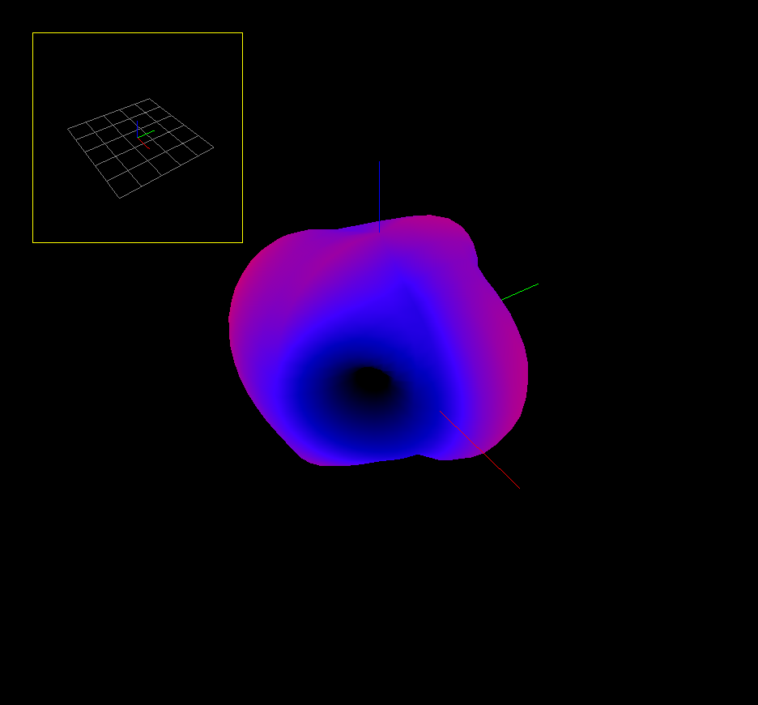

# necpy

necpy is a work-in-progress, antenna characteristics computation tool, written in Python. It follows the principles of the original Numerical Electromagnetics Code written in 1970s by Burke and Poggio.

*Figure: Far-field radiation pattern of a randomly-initialized current distribution on a wire grid plotted by necpy.*
